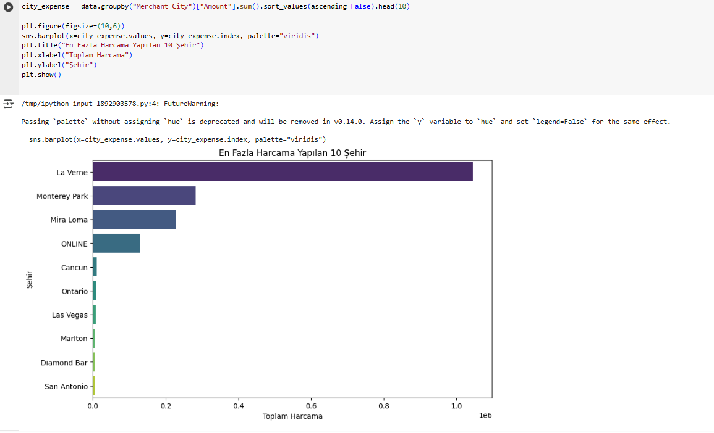
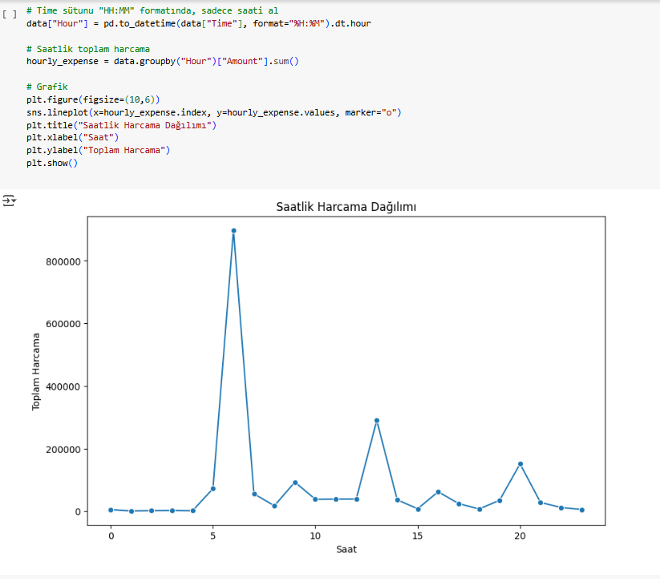
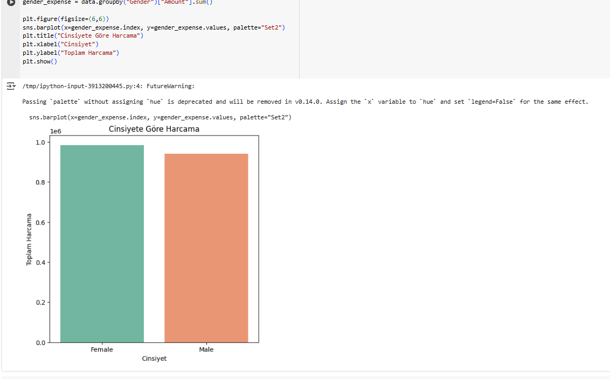
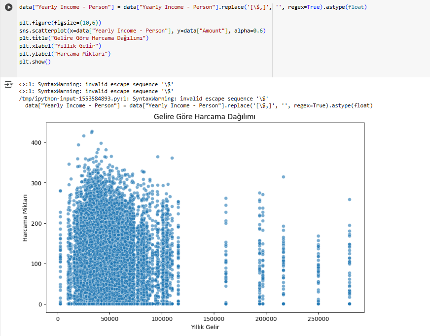
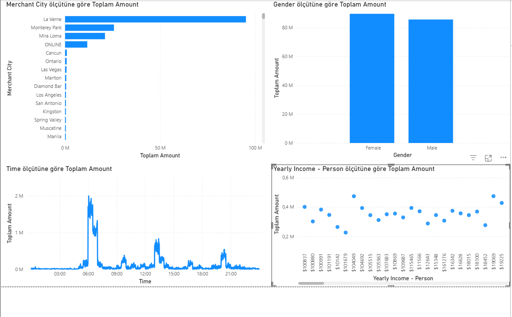

# ZelalErat_KrediKartAnalizi
# 💳 Credit Card Spending Analysis

Bu proje, kredi kartı kullanıcılarının harcama alışkanlıklarını analiz etmek amacıyla yapılmıştır.  
Python (Google Colab) ve Power BI kullanılarak görselleştirmeler yapılmıştır.

---

## 🚀 1. Kullanılan Teknolojiler
- Python, Pandas, Matplotlib, Seaborn  
- Google Colab  
- Power BI  

---

## 📊 2. Analiz Aşamaları (Python / Colab)

1. Veri yükleme ve birleştirme  
2. En fazla harcama yapılan 10 şehir  
3. Saatlik harcama dağılımı  
4. Cinsiyete göre harcama  
5. Gelire göre harcama  

### 🔹 Örnek Çalışma Görselleri:
- En fazla harcama yapılan şehirler:
  

- Saatlik harcama dağılımı:
  

- Cinsiyete göre harcama:
  

  - Cinsiyete göre harcama:
  
  

---

## 📈 3. Power BI Dashboard

- En fazla harcama yapılan 10 şehir  
- Harcamaların saate göre dağılımı  
- Cinsiyete göre harcama  
- Gelir grubuna göre harcama  

### Dashboard Ekran Görüntüsü:

---

## ⚙️ 4. Projenin Çalıştırılması

- Python Analizi:  
  [Google Colab Linkim](https://colab.research.google.com/drive/1F1VciPLmJSOsDajYe6OPrggx_KEh1Msl?usp=sharing)

- Power BI:  
  `credit_analysis.pbix` dosyasını indirip Power BI Desktop ile açabilirsin.

---

